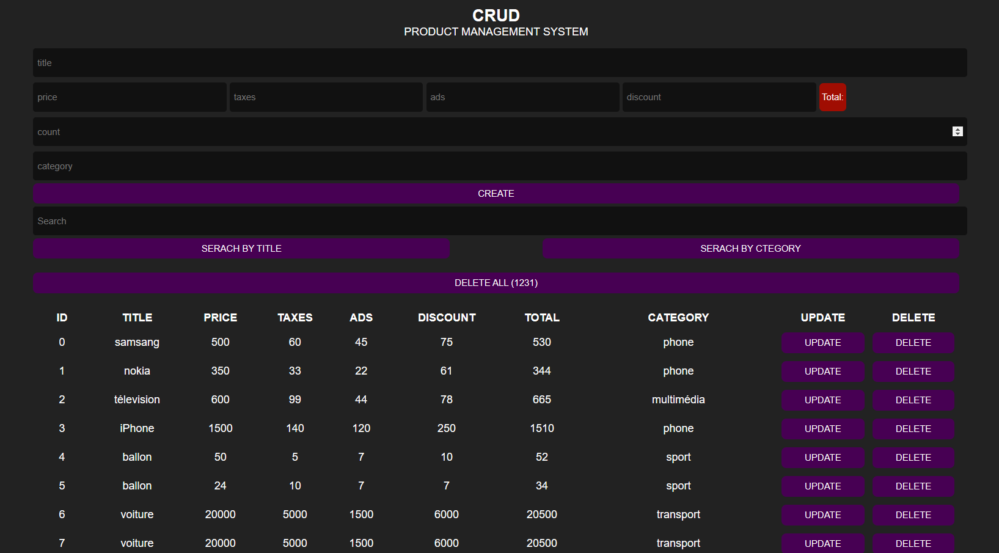

# Ce projet consiste à créer un système de gestion de produits avec javascript.

## Les 4 opérations de base : CRUD

Le CRUD (parfois SCRUD le S signifie Search), indique les 4 operations de base pour gérer tous types de données(Create, Read, Update, Delete).

Chaque opération est importante et s’il vient à en manquer une dans un projet, ce dernier serait incomplet.

